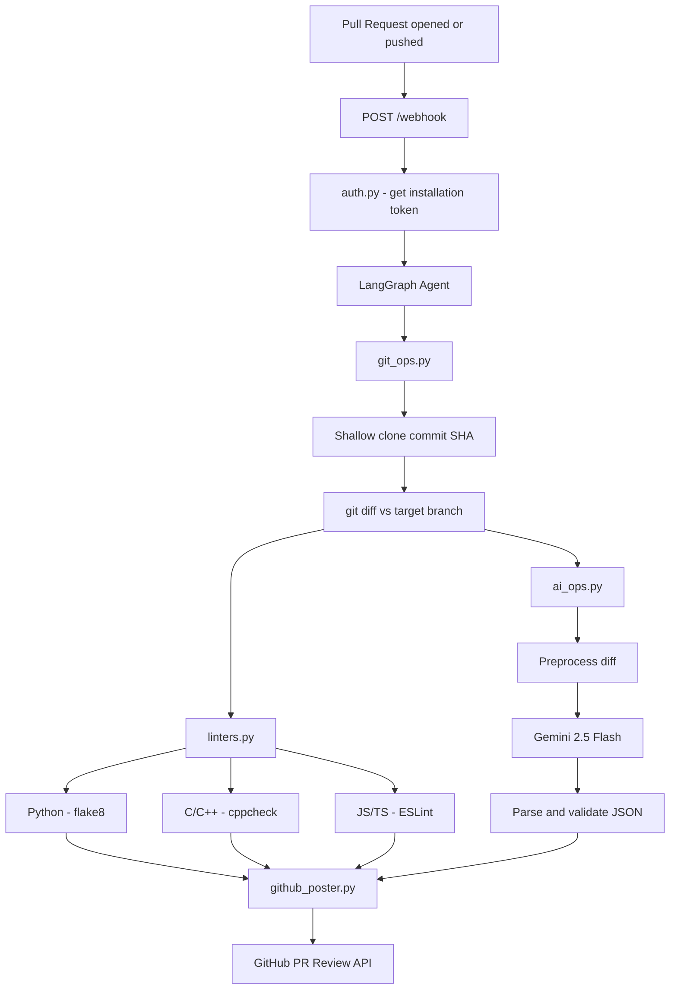
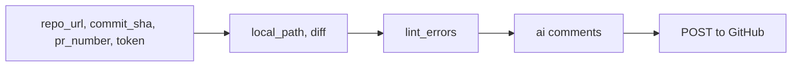

# Autonomous PR Reviewer — Architecture

## Full system flow

## AgentState data flow

## Module responsibilities

| File | Role |
|---|---|
| `main.py` | Flask server, single `/webhook` route, wires everything together |
| `auth.py` | GitHub App auth, generates short-lived installation access tokens |
| `agents/graph.py` | LangGraph state machine, orchestrates the three tools in sequence |
| `git_ops.py` | Shallow clone by SHA, diff vs target branch, temp dir cleanup |
| `linters.py` | Walks repo, detects languages, dispatches to correct linter |
| `ai_ops.py` | Preprocesses diff, calls Gemini, validates and caps JSON output |
| `github_poster.py` | Formats comments and posts them to the GitHub PR Review API |